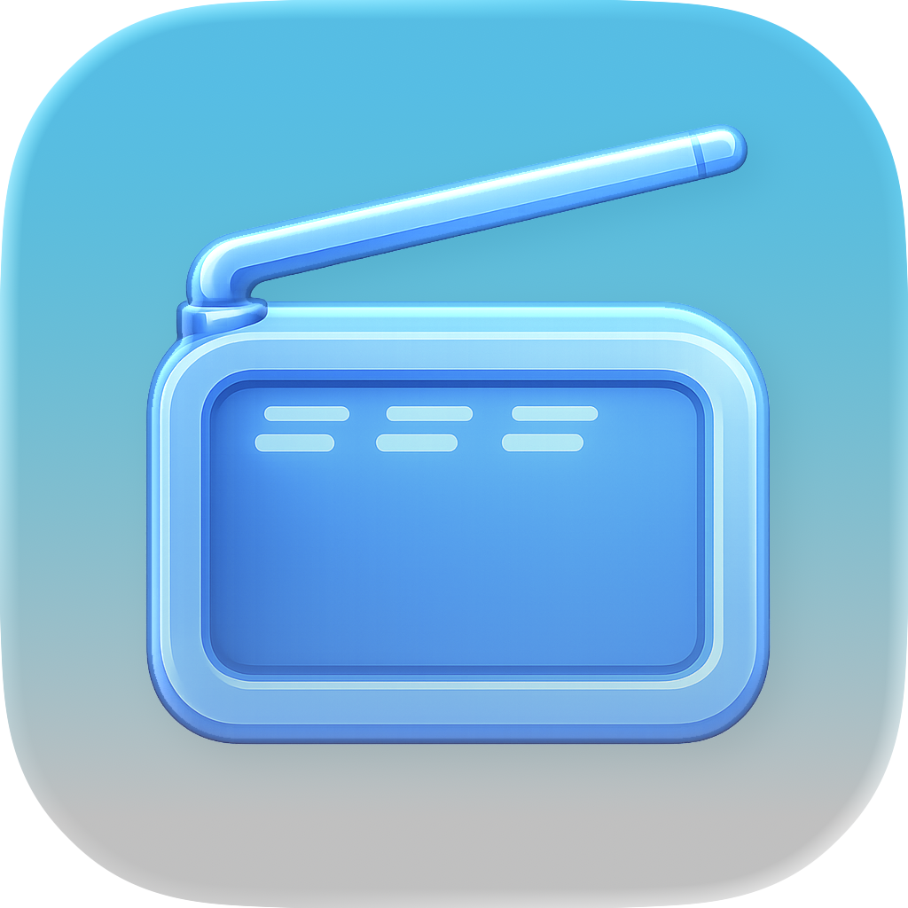
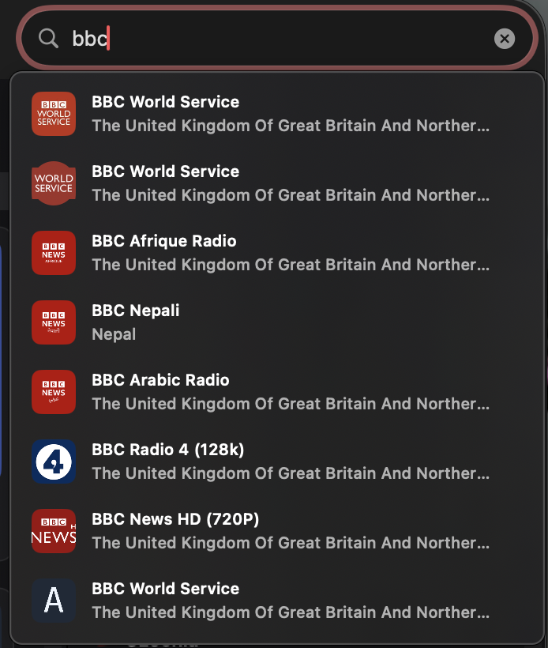
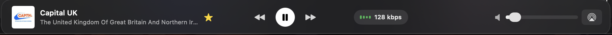

# RadioGlass

<p align="left">
  
</p>

RadioGlass is a macOS SwiftUI app inspired by Apple Music, with a liquid-glass visual style and global live radio discovery. It brings curated country radio into a single player, with fast search, favorites, and AirPlay support.

## Screenshots


## Feature highlights
| Feature | Preview |
| --- | --- |
| Quick search pop-down shows live matches and plays instantly |  |
| Player bar stays centered with throughput meter and volume/AirPlay controls |  |
| AirPlay routing is one click away from the main player |  |

## Download

Latest release (macOS):

```
https://github.com/JoshABrasso/glass-radio/releases/tag/radioglass-mac
```

## Implemented foundation

- Apple Music-like split layout (Sidebar + content + persistent player bar)
- Liquid glass cards and atmospheric gradient backdrop
- Featured station cards and hero section for premium first-load experience
- Global trending stations from Radio Browser
- Curated top countries list (by station count)
- Country-level popular station view
- Global station search
- Favorites add/remove with persistence in `UserDefaults`
- Recently played station rail
- In-app streaming using `AVPlayer`
- AirPlay route picker (`AVRoutePickerView`)
- Now Playing metadata integration (`MPNowPlayingInfoCenter`)
- Media key / Control Center command support (`MPRemoteCommandCenter`)
- App-level playback command menu and handoff activity metadata

## What’s new (2026-02-11)
- Quick search drop-down now plays a station on click and keeps results visible after Enter.
- Full search updates live under the search bar with a clear/reset control; results stay at the top of the pane.
- Player bar refinements: fixed-width regions, centered controls, single-line throughput pill, compact height.
- Side panes use larger, bolder text; preset reordering is working again.

## Project layout

- `Package.swift`
- `Sources/RadioGlass/RadioGlassApp.swift`
- `Sources/RadioGlass/Views/` UI
- `Sources/RadioGlass/ViewModels/` app state
- `Sources/RadioGlass/Services/` API, playback, persistence
- `Sources/RadioGlass/Theme/` liquid-glass styling helpers

## Open and run

1. Open `RadioGlass.xcodeproj` in Xcode.
2. Select the `RadioGlass` scheme.
3. In Signing & Capabilities, set your Team for `com.radioglass.app`.
4. Run on `My Mac`.

## Run without Xcode

1. Build a standalone app bundle:
   `./scripts/build-app.sh`
2. Open the app:
   `open dist/RadioGlass.app`

## Xcode project details

- Project: `RadioGlass.xcodeproj`
- Shared scheme: `RadioGlass.xcodeproj/xcshareddata/xcschemes/RadioGlass.xcscheme`
- Info plist: `App/Info.plist`
- Entitlements: `App/RadioGlass.entitlements`
- Enabled capability baseline:
  - App Sandbox
  - Outgoing Network Connections (`com.apple.security.network.client`)

## Notes

- This uses the public Radio Browser API endpoint:
  `https://de1.api.radio-browser.info/json`
- Production hardening still needed: retries, better artwork fallback, stream health checks, and richer queue/session handling.
